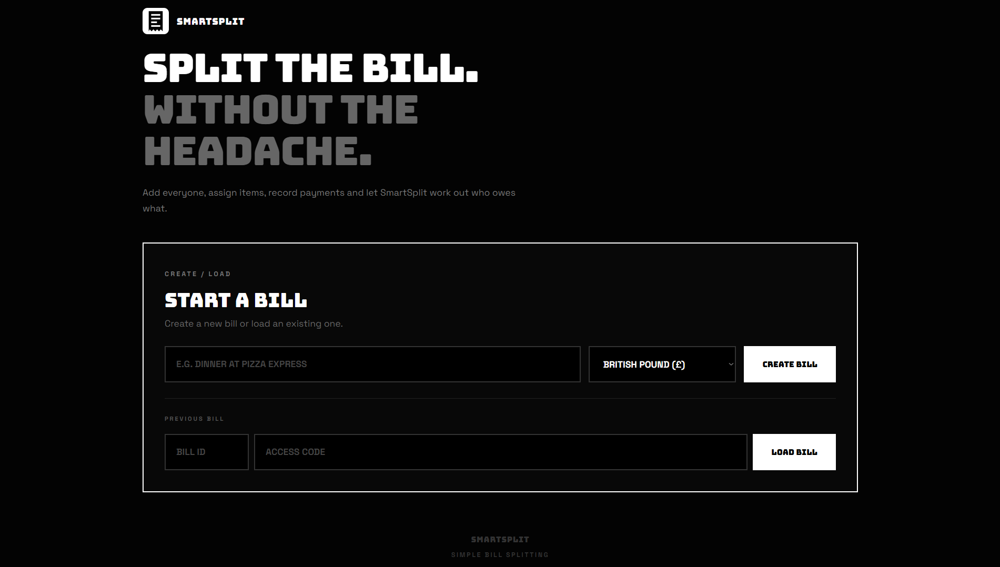
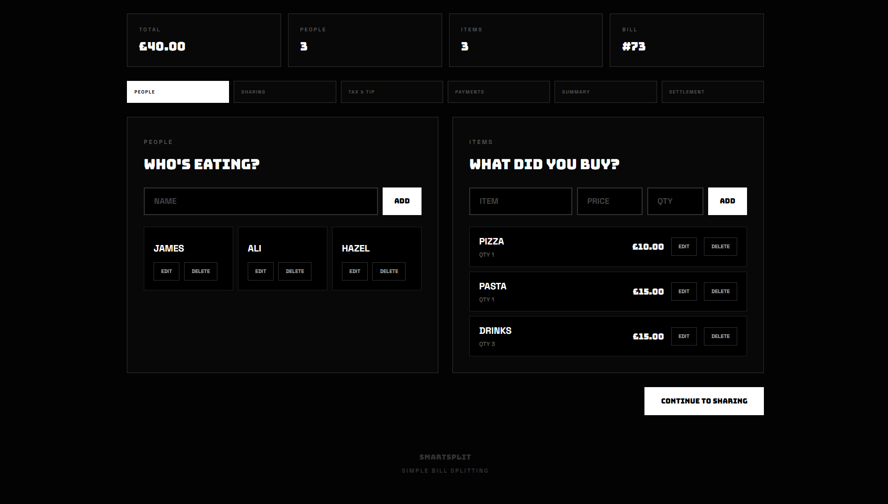
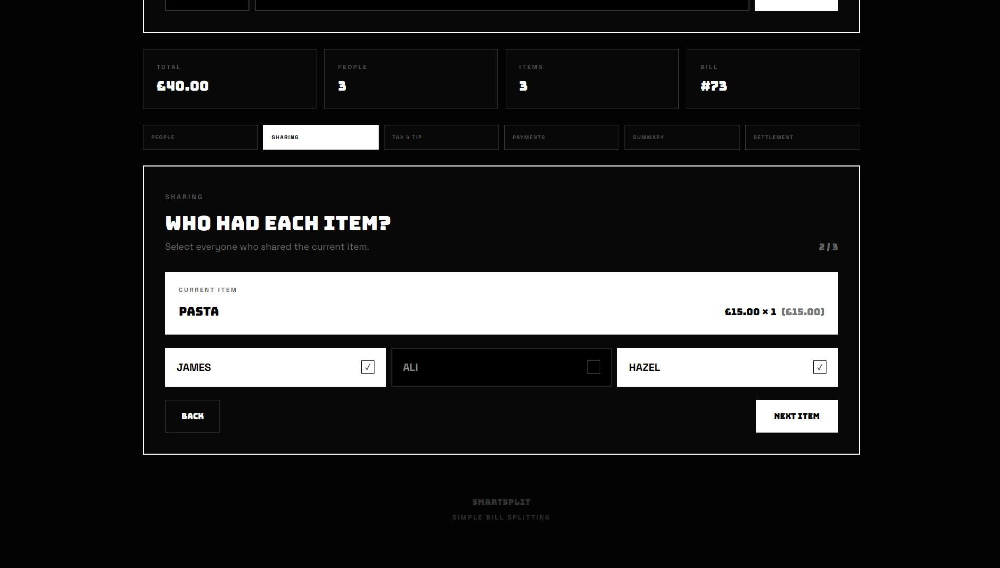
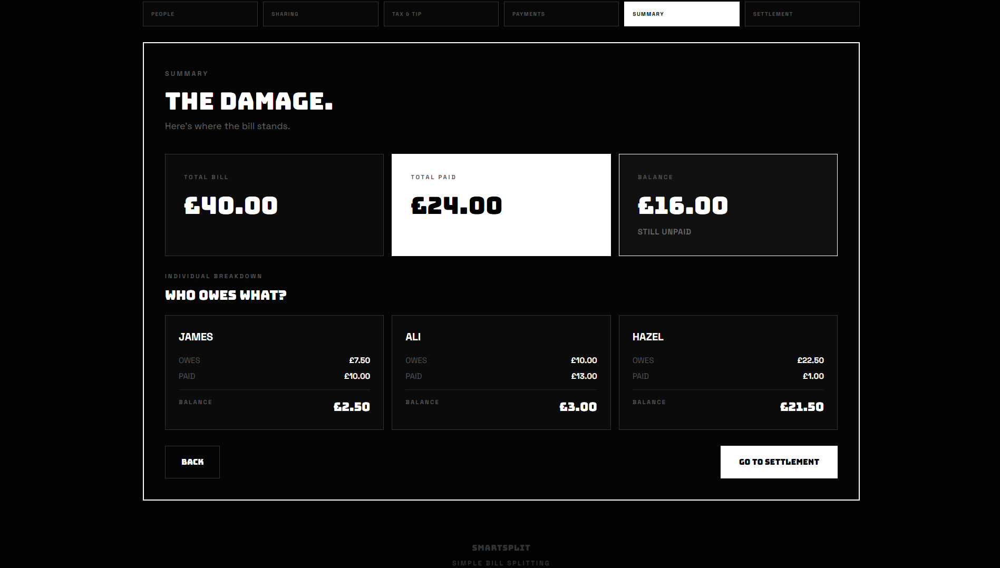
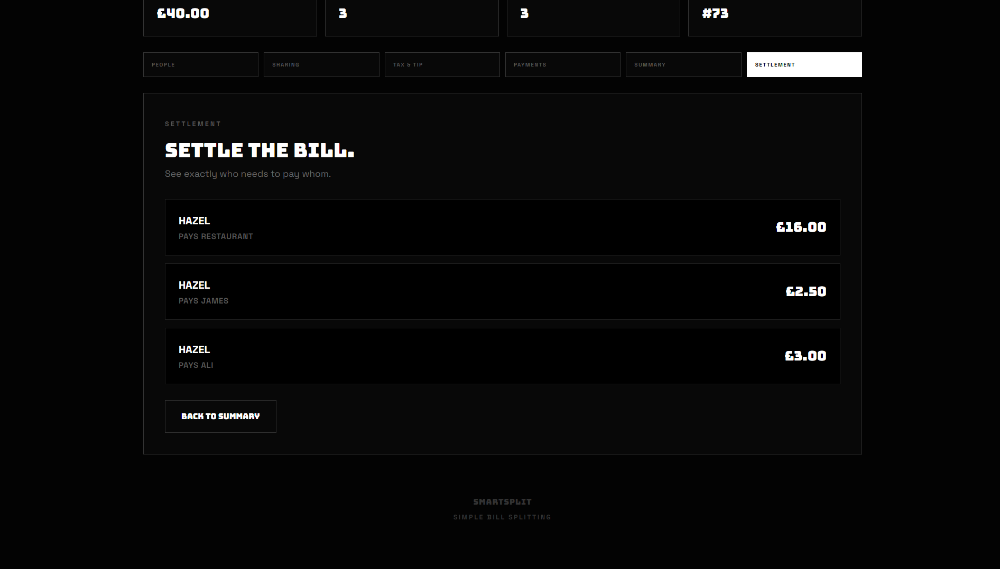

# SmartSplit

SmartSplit is a full-stack bill-splitting app. A Spring Boot REST API handles the split logic and a TypeScript frontend gives you a UI on top of it.

Create a bill, add people and items, split items between people, add tax and tip, record who paid, and get the minimum set of transactions needed to settle up.



## Screenshots

| Add people & items | Share items |
| --- | --- |
|  |  |

| Summary | Settlement |
| --- | --- |
|  |  |

## Features

- Create bills and add, edit and delete people
- Add, edit and delete items with prices and quantities, and split each item between one or more people
- Distribute tax proportionally to each person's subtotal
- Split tip equally
- Record payments
- Calculate each person's total, paid amount, and balance
- Generate settlement transactions (who pays whom)
- View a complete bill summary
- Reload a previous bill with its bill ID and access code
- Multi-currency display (GBP, USD, EUR, INR, PKR, SAR, AED)
- Persistent storage in PostgreSQL

## Tech Stack

| Layer    | Technology                                  |
| -------- | ------------------------------------------- |
| Backend  | Java 21, Spring Boot, Spring Data JPA, Maven |
| Database | PostgreSQL (Supabase or local)              |
| Frontend | TypeScript, Next.js, React, Tailwind CSS    |
| Testing  | JUnit                                       |

## Project Structure

```
smartsplit/
├── smartsplit/            # Spring Boot backend
│   └── src/main/java/...  # Bill, Person, Item, SettlementTransaction, controllers
└── smartsplit-frontend/   # TypeScript frontend
```

The domain classes (`Bill`, `Person`, `Item`, `SettlementTransaction`) contain the splitting logic. Controllers only handle HTTP.

## Getting Started

### Prerequisites

- Java 21
- Maven
- Node.js 18+ and npm
- A PostgreSQL database (local, or a Supabase project)

### 1. Backend

Database credentials are read from environment variables, so nothing sensitive is committed.

```bash
export DB_URL="jdbc:postgresql://<host>:<port>/<database>"
export DB_USERNAME="<username>"
export DB_PASSWORD="<password>"

cd smartsplit
mvn spring-boot:run
```

The API starts on `http://localhost:8080` by default.

### 2. Frontend

```bash
cd smartsplit-frontend
npm install
npm run dev
```

The app runs on `http://localhost:3000`. The frontend reads the API URL from `.env.local` and falls back to `http://localhost:8080`:

```env
NEXT_PUBLIC_API_URL=http://localhost:8080
```

### Running tests

```bash
cd smartsplit
mvn test
```

## API Overview

Creating a bill returns a bill ID and an access code. Requests for that bill send the code in the `X-Bill-Access-Code` header.

| Method | Endpoint                | Description                               |
| ------ | ----------------------- | ----------------------------------------- |
| POST   | `/bill`                 | Create a bill                             |
| GET    | `/bill/load?billId=`    | Load a previous bill                      |
| POST   | `/person`               | Add a person                              |
| PUT    | `/person`               | Rename a person                           |
| DELETE | `/person`               | Remove a person                           |
| POST   | `/item`                 | Add an item                               |
| PUT    | `/item`                 | Edit an item                              |
| DELETE | `/item`                 | Remove an item                            |
| POST   | `/shareItem`            | Share an item with a person               |
| POST   | `/unshareItem`          | Remove a person from an item              |
| POST   | `/tax`                  | Set tax                                   |
| POST   | `/tip`                  | Set tip                                   |
| POST   | `/paid`                 | Record a payment                          |
| GET    | `/summary?billId=`      | Get each person's total, paid and balance |
| POST   | `/settlement`           | Calculate settlement transactions         |

## Example

Three people split a meal:

| Person | Paid | Owes   | Balance |
| ------ | ---- | ------ | ------- |
| Rayyan | £30  | £24.75 | +£5.25  |
| Ahmed  | £20  | £24.75 | −£4.75  |
| Ali    | £8   | £8.50  | −£0.50  |

Settlement:

- Ahmed → Rayyan: £4.75
- Ali → Rayyan: £0.50

## How the Maths Works

- **Item split:** each item's price is divided between the people sharing it.
- **Tax:** distributed in proportion to each person's item subtotal.
- **Tip:** split equally across everyone on the bill.
- **Balance:** amount paid minus amount owed. Positive means they are owed money, negative means they owe.
- **Settlement:** people who owe are matched against people who are owed until all balances reach zero.

## Roadmap

- Authentication and saved bill history
- Share a bill via link
- Receipt scanning
- CI with GitHub Actions (Maven build and tests)

## Author

Built by [Rayyan](https://github.com/rayyanzzahid).
